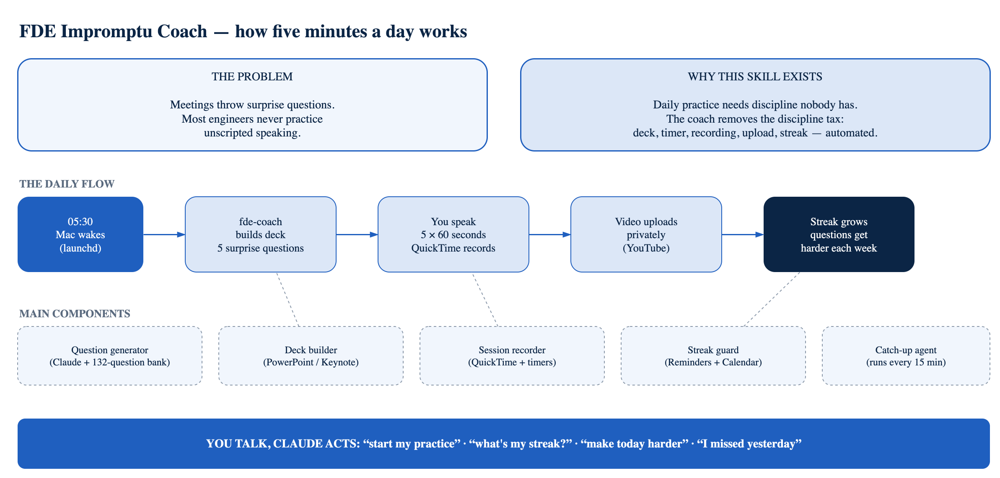

# FDE Impromptu Coach

> **Software Factory video series:** the 35-day learning path is in [`fde-impromptu-coach/references/factory_learning_path.md`](fde-impromptu-coach/references/factory_learning_path.md).

A Claude skill that trains you to speak clearly, on camera, without a script. Five minutes every morning. Forever.

## The Problem

Customer meetings throw surprise questions at you. Interviews demand instant, structured answers. Bad news needs a calm voice.

Most engineers never practice unscripted speaking. The skill rusts.

## Why This Skill Exists

Great communicators practice daily. Daily practice needs discipline nobody has.

This skill removes the discipline tax. It builds the deck, runs the timer, records the video, tracks the streak, and nags you when you skip — all by itself.

## How to Use It

1. **Install** — clone this repo, then run `bash fde-impromptu-coach/install.sh`
2. **Every morning at 05:30** — a deck with 5 surprise questions opens itself
3. **Click Start** — QuickTime records you; each question gets 60 seconds; everything stops and saves automatically
4. **Your video uploads privately** to YouTube, with chapter marks
5. **Talk to Claude any time** — "start my practice", "what's my streak?", "make today harder"

Miss a day? Reminders escalate on your Mac, iPhone, and calendar until you record.

## Software Factory Daily Video

From 10 October 2026 the coach also runs a daily technical video for a public YouTube channel: a 35-day learning path through Software Factory concepts and [Gas City](https://github.com/gastownhall/gascity), one concept per video, under three minutes.

- **Evening before:** a brief with the topic, WHAT, WHY, HOW, repository references, diagrams, the demo to prepare and a 3-minute outline (Mac + Google Calendar).
- **Recording day:** minimal blue slides, a keyword outline and the facts to verify.
- **A real demo in every video**, faceless: commands run in a demo city on your Mac and appear as an animated terminal, taught Greg Tang style (see it, group it, name it).
- **Up to three voice takes** over self-running slides (Discovery, Improve, Publish), then a finished video with intro and outro music. Your voice is never processed.

**📚 The full 35-day learning path, every day written out (WHAT, WHY, HOW, the demo commands, the picture, the 3-minute outline, references and facts to verify): [`fde-impromptu-coach/references/factory_learning_path.md`](fde-impromptu-coach/references/factory_learning_path.md).** Also see `fde-coach factory --help`.

## Supported Tools

- Claude Code
- Microsoft PowerPoint (full automation) or Apple Keynote (manual advance)
- QuickTime Player (camera + microphone required)
- YouTube — private uploads for practice; Software Factory videos are published by you in YouTube Studio
- ffmpeg — pronunciation and Software Factory videos
- Apple Reminders + Google Calendar for streak protection
- **macOS only**
